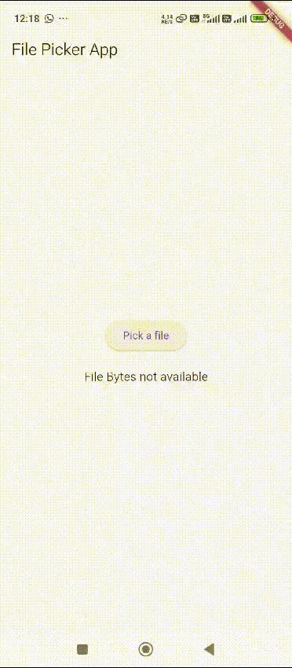
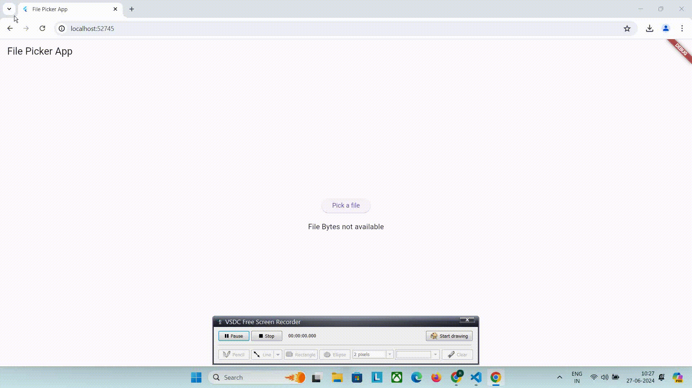

# Flutter File Picker App

**Description:**
A visually appealing Flutter application that allows users to easily select files from their device's storage using the `file_picker` package. This project showcases a user-friendly interface with modern design elements, ensuring an intuitive user experience.

**Features:**
- **File Selection**: Users can pick files from their device's storage.
- **File Details Display**: Shows the selected file's name and path in a clear, readable format.
- **Elegant UI**: Incorporates Material Design principles for a polished, professional look.
- **Responsive Design**: Ensures compatibility across different devices and screen sizes.

**Tech Stack:**
- Flutter
- Dart
- `file_picker` package

**How to Use:**
1. Clone the repository.
2. Run `flutter pub get` to install dependencies.
3. Use `flutter run` to start the application.

**GIFs:**

**Key Points:**
- **Autohandling Permissions:** The app automatically manages permissions for file access.
- **Web Platform Behavior:** When using `file_picker` on the web platform, it retrieves files as `Uint8List` (bytes) since direct file paths are not accessible.
- **Android Platform Behavior:** On Android, file access is based on file paths, allowing the creation of files from these paths.bytes property is not supported on Android.

**Getting Started:**
This project is ideal for developers looking to learn how to implement file picking functionality in a Flutter app with a focus on UI/UX design. Follow the steps below to get started:
1. Ensure Flutter is installed on your machine.
2. Clone the repository.
3. Open the project in your preferred IDE.
4. Run `flutter pub get` to install the necessary packages.
5. Start the app using `flutter run`.

**Contributions:**
Contributions are welcome! Feel free to open issues or submit pull requests with improvements and new features.
